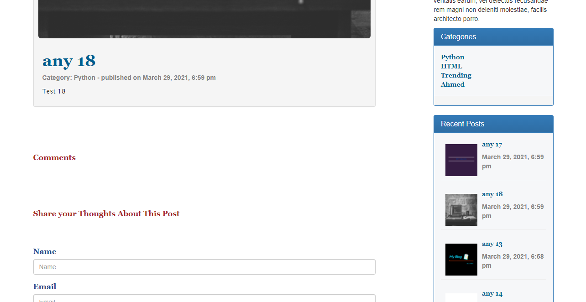

                                            >> My Bog << 

 My Blog is a website allow everyone share his Blogs in it , it's also allow other peaple to share them thoughts about the blog they read by Comments .

 How to use :

 Using php7,mysqli,html5,css3,bootstrap simply you can create config folder in the project and inside it create file with name "config.php" add in it your connection variabels and happy coding ...

                                       
                                       
                                       
                                       
                                       